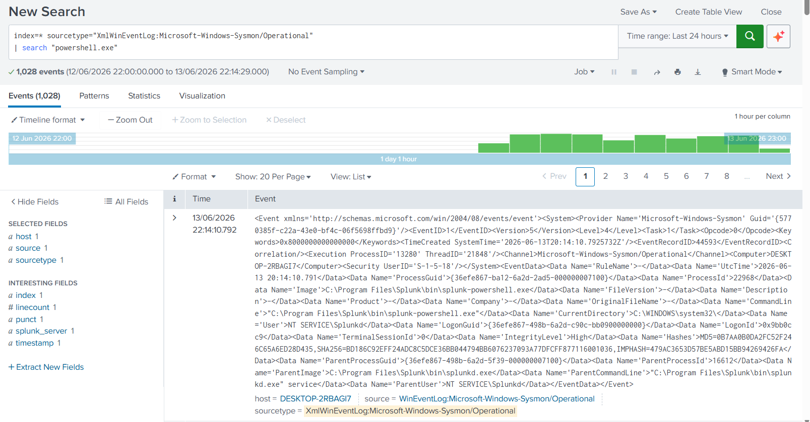
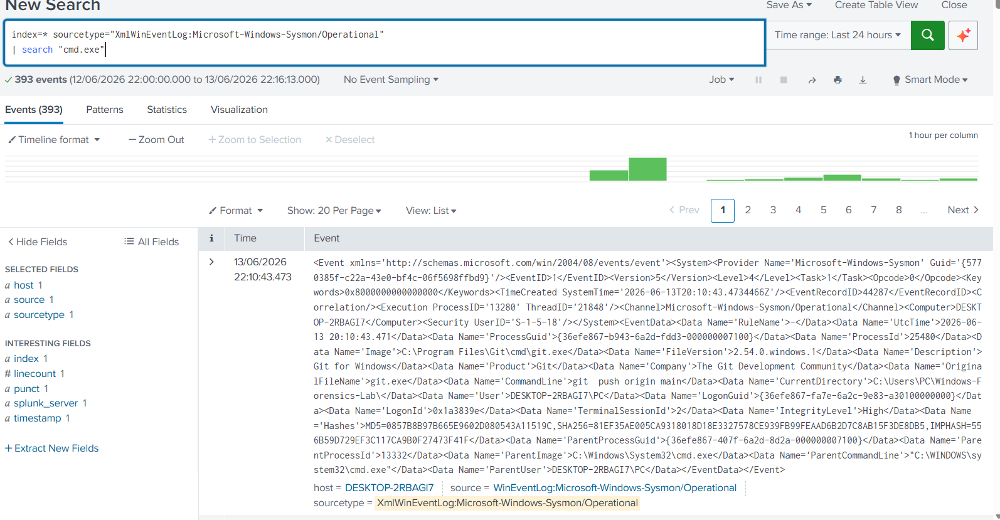
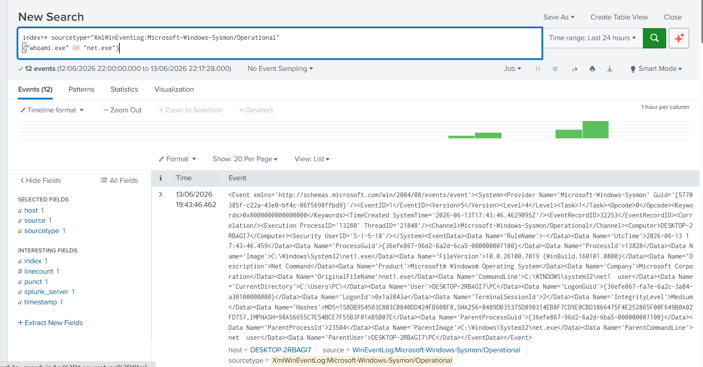
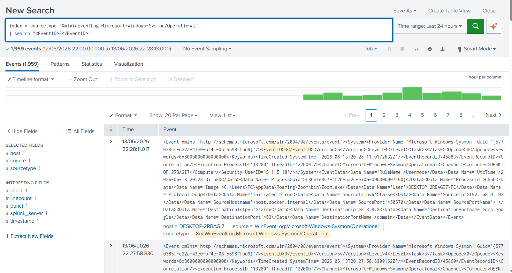
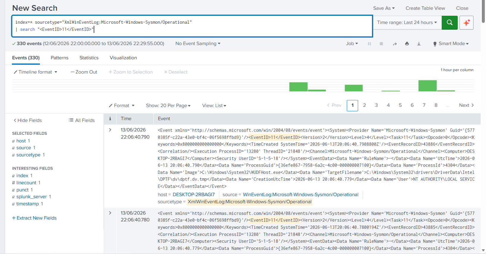

# Splunk Detection Engineering Lab

## Overview

This project demonstrates the creation and validation of security detections using Splunk Enterprise and Sysmon telemetry.

The lab focuses on identifying common attacker behaviors, developing detection logic, validating results, and mapping detections to MITRE ATT&CK techniques.

---

## Environment

| Component  | Details                              |
| ---------- | ------------------------------------ |
| SIEM       | Splunk Enterprise 10.4               |
| Endpoint   | Windows 11                           |
| Telemetry  | Sysmon                               |
| Log Source | Microsoft-Windows-Sysmon/Operational |
| Framework  | MITRE ATT&CK                         |

---

## Detection Documentation

Detailed detection write-ups are available in the `detections/` folder:

* [PowerShell Execution](detections/powershell_execution.md)
* [Command Shell Execution](detections/command_shell_execution.md)
* [Account Discovery](detections/account_discovery.md)
* [Network Connections](detections/network_connections.md)
* [File Creation](detections/file_creation.md)

---

## Detection 1 – PowerShell Execution

### Objective

Detect PowerShell execution activity that may indicate scripting, automation, or attacker execution.

### SPL Query

```spl
index=* sourcetype="XmlWinEventLog:Microsoft-Windows-Sysmon/Operational"
| search "powershell.exe"
```

### MITRE ATT&CK

| Technique ID | Technique  |
| ------------ | ---------- |
| T1059.001    | PowerShell |

### Evidence



---

## Detection 2 – Command Shell Execution

### Objective

Detect execution of Windows Command Prompt.

### SPL Query

```spl
index=* sourcetype="XmlWinEventLog:Microsoft-Windows-Sysmon/Operational"
| search "cmd.exe"
```

### MITRE ATT&CK

| Technique ID | Technique             |
| ------------ | --------------------- |
| T1059.003    | Windows Command Shell |

### Evidence



---

## Detection 3 – Account Discovery

### Objective

Detect account enumeration commands used during reconnaissance.

### SPL Query

```spl
index=* sourcetype="XmlWinEventLog:Microsoft-Windows-Sysmon/Operational"
("whoami.exe" OR "net.exe")
```

### MITRE ATT&CK

| Technique ID | Technique         |
| ------------ | ----------------- |
| T1087        | Account Discovery |

### Evidence



---

## Detection 4 – Network Connection Activity

### Objective

Detect Sysmon network connection events.

### SPL Query

```spl
index=* sourcetype="XmlWinEventLog:Microsoft-Windows-Sysmon/Operational"
| search "<EventID>3</EventID>"
```

### MITRE ATT&CK

| Technique ID | Technique                            |
| ------------ | ------------------------------------ |
| T1049        | System Network Connections Discovery |

### Evidence



---

## Detection 5 – File Creation Monitoring

### Objective

Detect file creation activity using Sysmon Event ID 11.

### SPL Query

```spl
index=* sourcetype="XmlWinEventLog:Microsoft-Windows-Sysmon/Operational"
| search "<EventID>11</EventID>"
```

### MITRE ATT&CK

| Technique ID | Technique             |
| ------------ | --------------------- |
| T1074        | Data Staged           |
| T1105        | Ingress Tool Transfer |

### Evidence



---

## Detection Summary

| Detection                   | Status    |
| --------------------------- | --------- |
| PowerShell Execution        | Validated |
| Command Shell Execution     | Validated |
| Account Discovery           | Validated |
| Network Connection Activity | Validated |
| File Creation Monitoring    | Validated |

---

## Skills Demonstrated

* Detection Engineering
* Splunk SPL Development
* Sysmon Analysis
* Windows Event Monitoring
* Threat Detection
* Security Monitoring
* MITRE ATT&CK Mapping
* SOC Operations
* Blue Team Analysis

---

## Key Takeaways

* Sysmon provides high-quality telemetry for detection engineering.
* Splunk enables rapid detection development and validation.
* Process, network, and file activity can be correlated to improve visibility.
* MITRE ATT&CK mapping helps standardize detection coverage.
* Detection engineering is a critical capability for modern SOC teams.

---

## Author

**Agata Gabara**

Cybersecurity Analyst | SOC Analyst | Threat Hunter

GitHub: https://github.com/ag48665
